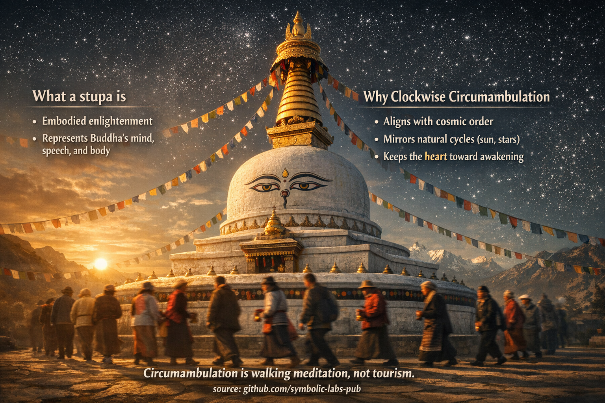

## [1. What a Stupa *Is* (Beyond Architecture)](https://github.com/symbolic-labs-pub/a-buddhist-view/blob/master/more/09_symbols/05_stupa/README.md#1-what-a-stupa-is-beyond-architecture)

---

In Buddhist teaching, a stupa is **not a monument**. It is a **three-dimensional teaching**.

### a) Embodied Enlightenment

A stupa represents the **awakened state itself**—the Buddha’s realization made visible.
Traditionally it embodies:

* **Body** → the physical form of [awakening](../../10_concepts/README.md#3-enlightenment-bodhi-awakening)
* **Speech** → the Dharma encoded in proportion, [mantra](../10_mantra/README.md#what-a-mantra-is-buddhist-view), and geometry
* **Mind** → the enlightened [awareness](../../10_concepts/README.md#2-awareness-rigpa-vijñāna-knowing) the structure points toward

This is why stupas are treated **as living presences**, not objects.

> You don’t *look at* a stupa.
> You **relate** to it.

---

### b) The Five Elements (Cosmic Alignment)

The [stupa](#1-what-a-stupa-is-beyond-architecture)’s shape maps directly onto the **five elements** that compose both the cosmos and the human being:

| Stupa Part    | Element | Meaning                      |
| ------------- | ------- | ---------------------------- |
| Square base   | Earth   | Stability, ethical grounding |
| Dome          | Water   | Continuity, [compassion](../../02_from_ignorance_to_awakening/7_compassion/README.md#compassion-as-a-structural-principle-in-buddhist-teaching)       |
| Spire         | Fire    | Transformation, effort       |
| Parasol discs | Air     | Movement, activity           |
| Jewel/top     | Space   | Openness, [wisdom](../../01_core_teachings/the_noble_eightfold_path/README.md#1-wisdom-paññā)             |

Circumambulating means **placing your own body into this elemental [mandala](../07_mandala/README.md#mandala--explained-according-to-buddhist-teachings)**.

---

## 2. Why Circumambulation Is Clockwise

Clockwise movement is not cultural—it is **cosmological and psychological**.

### a) Alignment with Dharma Order

In Buddhist cosmology, **clockwise mirrors the natural order**:

* Sun and stars (as perceived from Earth)
* The traditional movement of energy in ritual
* The unfolding of cause → effect → liberation

Moving clockwise means **not resisting reality**, but flowing *with* it.

---

### b) Keeping the Heart Toward Awakening

When walking clockwise:

* Your **right side** faces the stupa
* The **heart side** is turned inward
* The awakened state remains the **center of gravity**

Symbolically:

> *Awakening stays central while life moves around it.*

This subtly trains the mind to **orient experience around [wisdom](../../01_core_teachings/the_noble_eightfold_path/README.md#1-wisdom-paññā)**, not ego.

---

## 3. Circumambulation as Walking Meditation

In Buddhist teaching, this practice integrates **body, speech, and mind**:

* **Body** → walking with awareness
* **Speech** → mantras, prayers, or silent intention
* **Mind** → recollection of refuge, [impermanence](../../01_core_teachings/impermanence/README.md#2-impermanence-anicca-is-structural-not-accidental), [compassion](../../02_from_ignorance_to_awakening/7_compassion/README.md#compassion-as-a-structural-principle-in-buddhist-teaching)

It is therefore a **complete practice**, not a devotional add-on.

Even a single [mindful](../../01_core_teachings/the_noble_eightfold_path/README.md#7-right-mindfulness-sammā-sati) circuit is considered **meritorious**, because:

* The body enacts devotion
* The mind rehearses orientation toward awakening
* The ego loosens its claim to centrality

---

## 4. Why It Is *Not* Tourism

Tourism moves **around an object**.
Circumambulation moves **around a meaning**.

From a Buddhist perspective:

* Speed is irrelevant
* Number of rounds is secondary
* **Orientation of mind** is decisive

A distracted monk gains little.
A sincere passerby gains benefit.

---

## 5. Deep Teaching Encoded in the Act

At the deepest level, circumambulation teaches:

* There is **no fixed self at the center**
* Awakening is **stable; phenomena revolve**
* Liberation happens through **right relationship**, not escape

You do not conquer the stupa.
You **orbit it**—as planets orbit truth.

---

## In One Sentence (Traditional Insight)

> **To walk clockwise around a stupa is to rehearse enlightenment with the body before the mind fully understands it.**

---

< [Prayer Flags (Lungta) — Explained Through Buddhist Teachings](../04_prayer_flags/README.md) | [Mala (Prayer Beads) — Explained According to Buddhist Teachings](../06_mala/README.md) >

_source: [github.com/symbolic-labs-pub](https://github.com/symbolic-labs-pub)_

---
