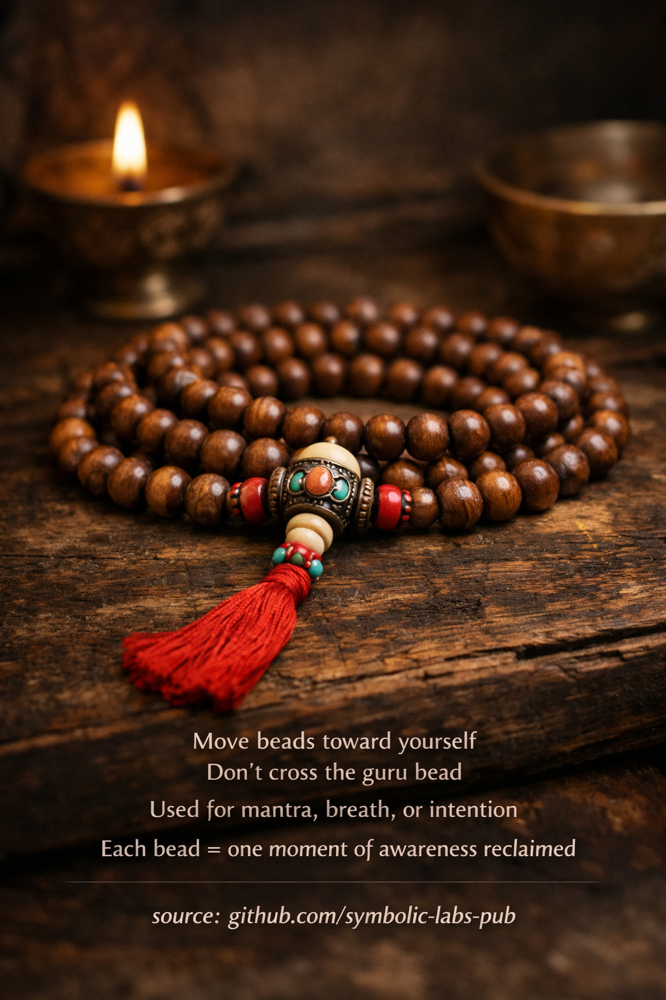

## [Mala (Prayer Beads) — Explained According to Buddhist Teachings](https://github.com/symbolic-labs-pub/a-buddhist-view/blob/master/more/09_symbols/06_mala/README.md#mala-prayer-beads--explained-according-to-buddhist-teachings)

---

In Buddhism, the **mala** is not jewelry and not a talisman. It is a **discipline instrument**—a physical structure that stabilizes attention and trains continuity of [awareness](../../10_concepts/README.md#2-awareness-rigpa-vijñāna-knowing).

---

### 1. Why **108 beads**

The number **108** appears across Indian and Tibetan contemplative systems because it represents **completeness of conditioned experience**.

Common explanations include:

* 108 **mental afflictions** (kleshas) to be purified
* 6 senses × 3 tones × 2 modes × 3 times = 108 ways experience arises
* A **full circuit of samsaric conditioning**

Using the mala means:

> *“I bring awareness to the full spectrum of my experience, one moment at a time.”*

Each bead is not symbolic by itself—it becomes meaningful **only when awareness touches it**.

---

### 2. The **Guru Bead** (Meru)

The larger bead is **not counted**.

Why?

* It represents the **source** of the practice, not an object within it
* It points to the **teacher, lineage, and awakened mind itself**
* Crossing it would imply “counting” the source as an object—which Buddhism avoids

When you reach the guru bead:

* You **pause**
* You **turn the mala around**
* You **re-enter the cycle consciously**

This teaches:

> *[Awakening](../../10_concepts/README.md#3-enlightenment-bodhi-awakening) is not surpassed or left behind—it is repeatedly re-entered.*

---

### 3. Why beads move **toward yourself**

In [Vajrayāna](../../05_yanas/README.md#4-vajrayāna-tantrayāna-mantrayāna---the-diamond-vehicle) and [Mahāyāna](../../05_yanas/README.md#limitation-from-mahāyāna-view) usage, beads are drawn **toward the body** to signify:

* Drawing awareness inward
* Returning attention to **immediate experience**
* Reclaiming attention from distraction

This is not superstition—it is **somatic psychology**:

> Movement reinforces mental direction.

---

### 4. Mala as **walking mind**

A mala externalizes what [meditation](../../08_lineage/README.md) trains internally:

* Continuity without force
* Rhythm without hurry
* Structure without rigidity

Used properly, it prevents:

* Spacing out
* Mechanical repetition
* Egoic achievement (“I did 10,000 mantras”)

The mala doesn’t care about numbers.
It cares about **presence per bead**.

---

### 5. Mantra, breath, or intention

Traditionally:

* [**Mantra**](../10_mantra/README.md#what-a-mantra-is-buddhist-view) trains sound + meaning + devotion
* **Breath** stabilizes attention
* **Intention** (bodhicitta) aligns motivation

All three converge on one point:

> **Non-distraction sustained through form**

The mala gives the mind **just enough work** to stop wandering,
but not enough to dominate awareness.

---

### 6. The deeper meaning

> **Each bead = one moment reclaimed from unconsciousness**

Nothing mystical is added.
Nothing external is invoked.

What changes is:

* Repetition becomes **recognition**
* Counting becomes **continuity**
* Time becomes **presence**

The mala is successful **only when it disappears into awareness**.

---

### Summary (Traditional View)

* The mala **does not grant blessings**
* It **reveals continuity**
* It **trains humility**
* It **embeds practice into the body**

In Buddhism, tools do not save you.
They **train you not to leave awareness behind**.

---

< [1. What a Stupa *Is* (Beyond Architecture)](../05_stupa/README.md) | [1. What a mandala *is* (ontologically)](../07_mandala/README.md) >

_source: [github.com/sybolic-labs-pub](https://github.com/sybolic-labs-pub)_

---
