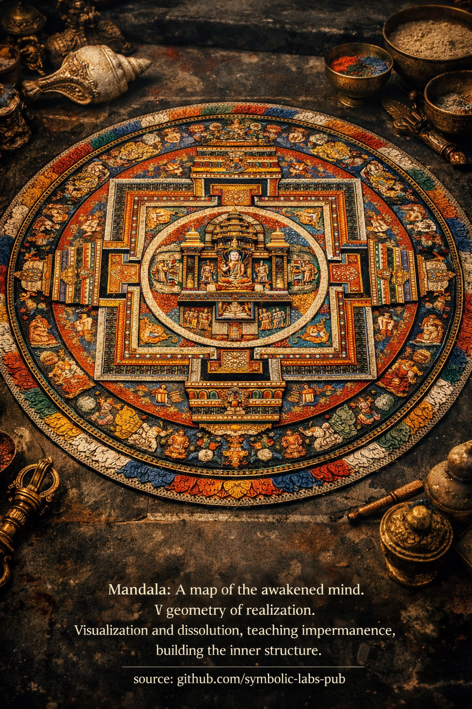

### Mandala — explained according to Buddhist teachings

---

In Buddhism (especially [Vajrayāna](../../05_yanas/README.md#4-vajrayāna-tantrayāna-mantrayāna---the-diamond-vehicle)), a **mandala** is not an ornament or a symbolic picture. It is a **functional model of awakened cognition**—a training environment for the mind.

---

## 1. What a mandala *is* (ontologically)

A mandala is a **representation of enlightened mind as structure**.

* The **center** represents awakened [awareness (often a Buddha or yidam)](../../10_concepts/README.md#2-awareness-rigpa-vijñāna-knowing).
* The **surrounding palace** represents stabilized qualities of mind.
* The **gates, walls, and circles** represent discernment, [ethics](../../01_core_teachings/the_noble_eightfold_path/README.md#2-ethical-conduct-śīla), and protection from confusion.
* The **outer rings** (fire, [vajra](../02_dorje/README.md#dorje-vajra--explained-according-to-buddhist-teachings), [lotus](../08_lotus/README.md#the-lotus-in-buddhist-teaching)) represent the purification of obscurations.

In Buddhist terms, the mandala is a **display of [dependent origination](../../02_from_ignorance_to_awakening/3_dependent_origination/README.md#the-twelve-links-the-classic-formulation) seen clearly**—how [wisdom](../../01_core_teachings/the_noble_eightfold_path/README.md#1-wisdom-paññā), [compassion](../../02_from_ignorance_to_awakening/7_compassion/README.md#compassion-as-a-structural-principle-in-buddhist-teaching), clarity, and activity arise together when ignorance is absent.

> The mandala shows **what mind looks like when it is no longer fragmented**.

---

## 2. Why geometry matters

Mandala geometry is not aesthetic—it is **cognitive engineering**.

* Symmetry trains **non-preferential awareness**
* Axes train **directionless clarity**
* Repetition stabilizes **attention**
* Proportions encode **balanced faculties**

This is why mandalas are precise to the millimeter in traditional practice.
A distorted mandala trains a distorted mind.

> In Vajrayāna, **form is used deliberately to rewire perception**.

---

## 3. Visualization practice (generation stage)

When a practitioner visualizes a mandala:

1. Ordinary perception dissolves
2. Space becomes luminous and structured
3. The mandala arises **from [emptiness](../../10_concepts/01_emptiness/README.md#emptiness-śūnyatā-in-vajrayāna-buddhism)**
4. The practitioner inhabits it from the inside

This does **not** mean “imagining something pretty.”

It trains:

* Stability without grasping
* Clarity without effort
* Identity without ego

Eventually, **the boundary between observer and mandala collapses**.

> The mandala is not *seen*—it is *recognized*.

---

## 4. Dissolution and impermanence (completion stage)

After construction, the mandala is **dissolved**.

Sand mandalas are deliberately destroyed to demonstrate:

* All forms are conditioned
* Even sacred structures are empty
* Clinging to purity is still clinging

This directly trains **non-attachment to realization itself**.

> The highest mistake in Buddhism is attachment to [awakening](../../10_concepts/README.md#3-enlightenment-bodhi-awakening) experiences.

---

## 5. Why mandala is called “cognitive architecture”

Because it does what philosophy cannot:

* It **restructures perception**, not belief
* It integrates emotion, vision, body, and attention
* It encodes ethics, wisdom, and compassion simultaneously

A mandala is a **working model of mind after delusion has been removed**.

This is why it is used only with proper preparation:

* ethics (śīla)
* [concentration (samādhi)](../../01_core_teachings/the_noble_eightfold_path/README.md#8-right-concentration-sammā-samādhi)
* insight (prajñā)

Without these, mandala practice becomes aesthetic fantasy.

---

## 6. The deepest point

Ultimately, Buddhist teaching states:

* The mandala is **not outside**
* The deity is **not other**
* The palace is **your own cognition, seen clearly**

When this is understood:

> Every perception becomes a mandala.
> Every moment becomes sacred space.

---

### Summary (in one sentence)

**A mandala is the disciplined use of form to reveal formless awareness—training the mind to recognize its own awakened structure, then let it go.**

---

< [Mala (Prayer Beads) — Explained According to Buddhist Teachings](../06_mala/README.md) | [1. Purity *without* Rejection](../08_lotus/README.md) >

_source: [github.com/symbolic-labs-pub](https://github.com/symbolic-labs-pub)_

---
