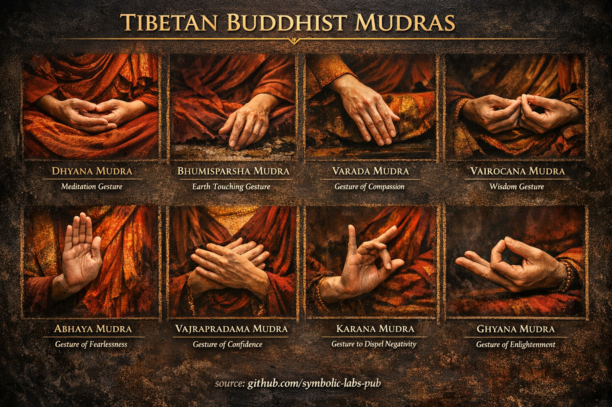

## [Mudrās in Buddhist Teachings](https://github.com/symbolic-labs-pub/a-buddhist-view/blob/master/more/09_symbols/11_mudra/README.md#mudrās-in-buddhist-teachings)

---

In Buddhism, **mudrās** are **intentional hand gestures** that **embody states of awakened mind**. They are not decorative, symbolic shorthand, or mere ritual habits. A mudrā is **a physical configuration that stabilizes cognition, intention, and realization simultaneously**.

In Vajrayāna and Tibetan Buddhism especially, **body, speech, and mind are trained together**. Mudrās belong to the **body gate**, but they directly condition the **mind gate**.

> A mudrā is **mind made visible through the body**.

---

## What Mudrās Actually Do (Functionally)

From a Buddhist technical perspective, mudrās serve four core functions:

### 1. **Cognitive Anchoring**

The body posture **locks attention** into a specific mode of [awareness](../../10_concepts/README.md#2-awareness-rigpa-vijñāna-knowing).

* Prevents drift into discursiveness
* Gives the mind a *shape* to rest in

### 2. **Embodiment of View**

Each mudrā corresponds to a **realized perspective**:

* Fearlessness
* Non-attachment
* Grounded presence
* Compassionate action

You are not *expressing* these qualities — you are **assuming their structure**.

### 3. **Energetic Regulation (Vajrayāna view)**

Mudrās organize subtle channels (*tsa*), winds (*lung*), and drops (*thigle*).

* This is **somatic neuro-regulation**, not superstition
* Comparable to modern embodied cognition theory

### 4. **Lineage Encoding**

Certain mudrās are **lineage-specific instructions** transmitted without words.

* They preserve realization when language would distort it
* This is why mudrās remain consistent across centuries

---

## Core Principle: Mudrā ≠ Symbol

A critical Buddhist distinction:

| Not a mudrā      | A mudrā                    |
| ---------------- | -------------------------- |
| Gesture as sign  | Gesture as **state**       |
| Cultural symbol  | **Cognitive architecture** |
| Expressive       | **Stabilizing**            |
| External meaning | **Internal alignment**     |

Mudrās work **only when paired with correct intention and view**. Without that, they are [empty](../../10_concepts/01_emptiness/README.md#emptiness-śūnyatā-in-vajrayāna-buddhism) forms.

---

## Examples of Meaning at the Structural Level

### Dhyāna Mudrā (Meditation Gesture)

* Hands form a closed circuit
* Represents **non-dual equilibrium**
* Used to train **uninterrupted awareness**

### Bhūmisparśa Mudrā (Earth-Touching)

* Calls reality itself as witness
* Represents **unshakable grounding**
* Used when confronting doubt, fear, or inner fragmentation

### Abhaya Mudrā (Fearlessness)

* Not reassurance, but **absence of threat**
* Trains nervous system to remain open without defense

### Varada Mudrā (Giving / Compassion)

* Open palm downward
* Embodies **effortless generosity**
* Action without grasping at results

---

## Why Mudrās Are Powerful (Even Without Belief)

Mudrās function **pre-conceptually**.

They work because:

* The nervous system responds to posture
* Attention follows bodily configuration
* Meaning arises from **enacted structure**, not belief

This aligns with:

* Embodied cognition research
* Predictive processing models
* Somatic [mindfulness](../../01_core_teachings/the_noble_eightfold_path/README.md#7-right-mindfulness-sammā-sati) practices

Buddhism discovered this **2,500 years ago**, empirically.

---

## A Subtle but Crucial Teaching

> Mudrās do not *cause* [awakening](../../10_concepts/README.md#3-enlightenment-bodhi-awakening).
> They **remove friction** so awakening can be recognized.

They are **constraints that reduce noise**, allowing clarity to appear.

---

## How to Use Mudrās Correctly (Practice Advice)

1. **Do not over-tighten** — relaxed precision is key
2. **Match mudrā to intention**, not mood
3. **Hold steadily**, without fidgeting
4. **Release without attachment** — the mudrā ends, the view remains

If tension appears, the mudrā has turned into control — release and reset.

---

## Final Insight

Mudrās are **silent instructions**.

They teach without words:

* How to sit
* How to act
* How to remain unshaken

In advanced practice, **the body itself becomes the teaching**.

---

< [What a Mantra *Is* (Buddhist View)](../10_mantra/README.md) | [The Bell (Ghanta)](../12_bell/README.md) >

_source: [github.com/symbolic-labs-pub](https://github.com/symbolic-labs-pub)_

---
