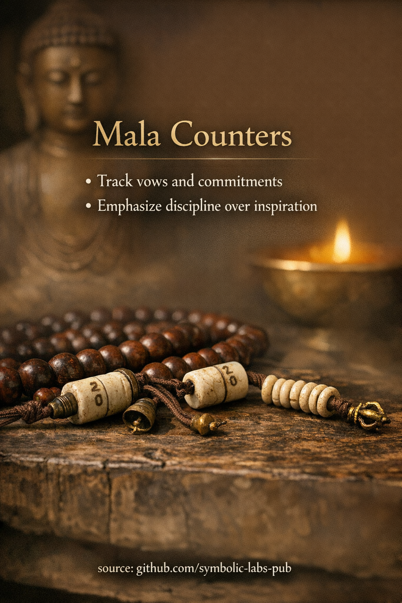

## [Mala Counters — explained through Buddhist teachings](https://github.com/symbolic-labs-pub/a-buddhist-view/blob/master/more/09_symbols/14_mala_counters/README.md#mala-counters--explained-through-buddhist-teachings)

---

**Mala counters** are not decorative accessories. In [Vajrayāna](../../05_yanas/README.md#4-vajrayāna-tantrayāna-mantrayāna---the-diamond-vehicle) Buddhism they exist for one reason only: **to uphold discipline when the mind no longer wants to cooperate**.

They appear when practice moves from *inspiration* to *commitment*.

---

### 1. What mala counters actually do

At the most practical level, mala counters:

* Count **large numbers of [mantra](../10_mantra/README.md#what-a-mantra-is-buddhist-view) recitations** (hundreds, thousands, tens of thousands)
* Prevent self-deception (“I think I did enough”)
* Externalize **accountability** when memory, mood, or motivation fluctuates

But in Buddhism, nothing is “just practical.”

The counter is **a mirror of vow integrity**.

---

### 2. Discipline over inspiration

Buddhist training is explicit about this:

> [Awakening](../../10_concepts/README.md#3-enlightenment-bodhi-awakening) is not produced by enthusiasm.
> It is revealed through **continuity**.

Mala counters exist because:

* Inspiration is unreliable
* Mood is [impermanent](../../01_core_teachings/impermanence/README.md#2-impermanence-anicca-is-structural-not-accidental)
* Ego selectively forgets inconvenient obligations

Counters therefore emphasize:

* **Regularity over intensity**
* **Structure over emotion**
* **Completion over performance**

They train the practitioner to continue **even when the practice is dry** — which is precisely when transformation occurs.

---

### 3. Relationship to vows and commitments

In Vajrayāna contexts, counters are often used when one has taken:

* **[Ngöndro](../../11_ngondro/README.md#what-is-ngöndro-in-mahāyāna-buddhism) commitments**
* **Mantra accumulation vows**
* **Daily or lifetime recitation pledges**
* **Post-empowerment samaya obligations**

Here the counter is not counting mantras.

It is counting **whether one honors one’s word**.

Breaking discipline is not a moral failure — it is a **loss of continuity**, which weakens realization.

---

### 4. Symbolic structure (why two counters)

Traditionally, counters often come in pairs, sometimes ending in:

* A **dorje ([vajra](../02_dorje/README.md#dorje-vajra--explained-according-to-buddhist-teachings))** → method, stability, [compassion](../../02_from_ignorance_to_awakening/7_compassion/README.md#compassion-as-a-structural-principle-in-buddhist-teaching) in action
* A **bell** → [wisdom](../../01_core_teachings/the_noble_eightfold_path/README.md#1-wisdom-paññā), [emptiness](../../10_concepts/01_emptiness/README.md#emptiness-śūnyatā-in-vajrayāna-buddhism), clarity

This subtly reinforces a core Vajrayāna teaching:

> Practice must accumulate **method and wisdom together**
> or it collapses into imbalance.

Even counting is framed as **non-dual training**.

---

### 5. Psychological function (often overlooked)

From a deeper cognitive perspective, mala counters:

* Reduce **decision fatigue**
* Bypass ego bargaining (“maybe tomorrow”)
* Convert abstract goals into **finite, embodied actions**
* Anchor practice in the body, not stories

They function like a **checksum for intention**.

---

### 6. Why they are not emphasized for beginners

Counters are rarely stressed early because:

* Beginners need **love for practice**, not pressure
* Counting too early can feed ego (“numbers = achievement”)

Counters appear naturally when the practitioner understands:

> Practice is no longer about how I feel.
> It is about what I uphold.

---

### 7. Essential teaching in one sentence

**Mala counters teach that awakening is built the same way anything real is built:
through quiet, repeated, unglamorous fidelity to what one has chosen.**

---

< [Skull Cup (Kapāla) — explained according to Buddhist teachings](../13_skull_cup/README.md) | [Thangka — Visual Transmission of the Path](../15_thangka/README.md) >

_source: [github.com/sybolic-labs-pub](https://github.com/sybolic-labs-pub)_

---
