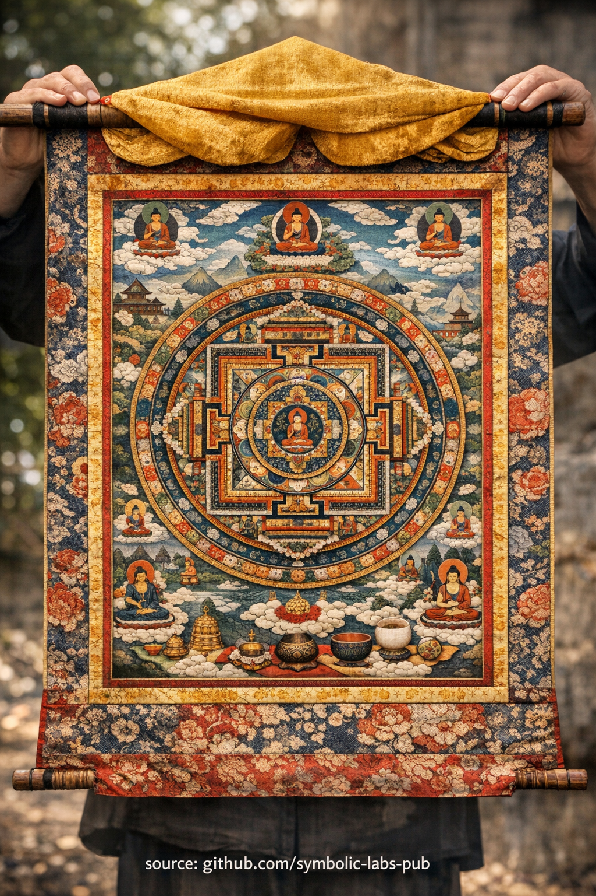

## [Thangka — Visual Transmission of the Path](https://github.com/symbolic-labs-pub/a-buddhist-view/blob/master/more/09_symbols/15_thangka/README.md#thangka--visual-transmission-of-the-path)

---

In Buddhist teachings, a **thangka** is not religious art in the decorative sense. It is a **functional cognitive instrument**—a **portable mandala** designed to train perception, stabilize attention, and transmit realization across generations.

### 1. Thangka as *Portable Mandala*

A [mandala](../07_mandala/README.md#mandala--explained-according-to-buddhist-teachings) is a **structured representation of awakened mind**.
A thangka condenses this structure into a **roll-up, mobile form**, allowing practitioners to carry the *entire path* with them.

Key insight:

> [Enlightenment](../../10_concepts/README.md#3-enlightenment-bodhi-awakening) is not abstract—it has **form, orientation, and internal geometry**.

Every element (center, directions, colors, proportions) mirrors how [awareness](../../10_concepts/README.md#2-awareness-rigpa-vijñāna-knowing) is meant to organize itself during practice.

### 2. Visual Transmission (Beyond Words)

Buddhism recognizes that **realization cannot be fully encoded in language**.
Thangkas function as **non-verbal lineage carriers**:

* Precise iconography preserves teachings unchanged for centuries
* Proportions follow strict canonical measurements
* Symbolism bypasses conceptual thinking and imprints directly on perception

This is why thangkas are called *“seeing teachings”* rather than illustrations.

> What texts explain sequentially, thangkas present **simultaneously**.

### 3. Visualization Training (Mind Engineering)

In [Vajrayāna](../../05_yanas/README.md#4-vajrayāna-tantrayāna-mantrayāna---the-diamond-vehicle) practice, thangkas are used for **[deity yoga](../../03_the_path_to_end_suffering/README.md#right-action) and visualization**:

* The practitioner studies the image externally
* Then reconstructs it internally with increasing precision
* Eventually, the distinction between image, observer, and mind dissolves

This trains:

* **Stability** (śamatha)
* **Clarity** (vipaśyanā)
* **Non-dual perception**

The goal is not imagination, but **controlled perception**.

### 4. Why Thangkas Are Rolled

The physical form itself is teaching:

* Rolled → **potential** (unmanifest)
* Unrolled → **appearance**
* Rolled again → **dissolution**

This mirrors:

* [Impermanence](../../01_core_teachings/impermanence/README.md#2-impermanence-anicca-is-structural-not-accidental)
* [Emptiness](../../10_concepts/01_emptiness/README.md#emptiness-śūnyatā-in-vajrayāna-buddhism)
* The arising and dissolving of phenomena in [meditation](../../08_lineage/README.md)

Nothing sacred is meant to be permanent in visible form.

### 5. Sacred Precision, Not Artistic Freedom

A traditional thangka painter is trained for years:

* Deviations are errors, not creativity
* Ego-expression is deliberately suppressed
* The painter acts as a **technical transmitter**, not an artist

This reflects a core Buddhist principle:

> Awakening is discovered by **alignment**, not invention.

### 6. Thangka in Daily Practice

Practically, thangkas are used to:

* Anchor meditation sessions
* Recalibrate motivation
* Restore correct view when mind drifts
* Maintain lineage continuity outside monasteries

They are **interfaces** between ordinary perception and awakened structure.

---

### Condensed Teaching

**A thangka is a map of mind that trains the mind by being seen.**
It is not symbolic art—it is **operational [dharma](../../01_core_teachings/the_three_jewels/README.md#2-dharma--the-path-and-the-law-of-reality)**.

---

< [Mala Counters — explained through Buddhist teachings](../14_mala_counters/README.md) | [Endless Knot (Śrīvatsa) — according to Buddhist teachings](../16_endless_knot/README.md) >

_source: [github.com/sybolic-labs-pub](https://github.com/sybolic-labs-pub)_

---
