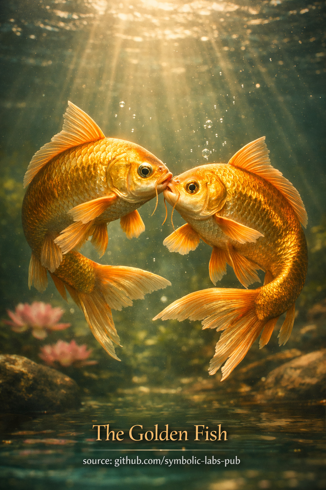

## [The Golden Fish — according to Buddhist teachings](https://github.com/symbolic-labs-pub/a-buddhist-view/blob/master/more/09_symbols/19_golden_fish/README.md#the-golden-fish--according-to-buddhist-teachings)

---

The **Golden Fish** are one of the **Eight Auspicious Symbols (Ashtamangala)** in Buddhism. Their meaning is subtle, experiential, and deeply practical.

---

### Core meaning

**Freedom from fear and [suffering](../../02_from_ignorance_to_awakening/2_the_four_noble_truths/README.md#1-there-is-suffering--dukkha).**

The two golden fish symbolize beings who have **crossed the ocean of saṃsāra**—the cyclic flow of conditioned existence—and now move freely within it.

Fish live in water without drowning.
Likewise, awakened beings live **within experience** without being trapped by it.

---

### Deeper teaching

#### 1. Freedom *within* conditions

The Golden Fish do **not** represent escape from the world.

They point to:

* Mastery of conditions rather than avoidance
* Presence without entanglement
* Activity without fear

This aligns with a central Buddhist insight:

> Liberation is not elsewhere — it is **how mind relates to experience**.

---

#### 2. Fearlessness born of understanding

Fear arises from:

* Grasping
* Resistance
* Misunderstanding [impermanence](../../01_core_teachings/impermanence/README.md#2-impermanence-anicca-is-structural-not-accidental)

The fish move effortlessly because they **understand the medium they live in**.
Similarly, realization comes from understanding:

* Impermanence
* [Emptiness](../../10_concepts/01_emptiness/README.md#emptiness-śūnyatā-in-vajrayāna-buddhism)
* Interdependence

Fear dissolves when reality is **seen clearly**, not when it is controlled.

---

#### 3. Joy and spontaneity

Golden Fish also symbolize:

* Joy that is not dependent on circumstances
* Spontaneous responsiveness
* Natural movement of awakened activity

This joy is not excitement or pleasure—it is the **ease of non-clinging**.

---

#### 4. The two fish

The pair is often interpreted as:

* **[Wisdom](../../01_core_teachings/the_noble_eightfold_path/README.md#1-wisdom-paññā) and [compassion](../../02_from_ignorance_to_awakening/7_compassion/README.md#compassion-as-a-structural-principle-in-buddhist-teaching)** moving together
* Balance of insight and activity
* Inner and outer freedom unified

[Awakening](../../10_concepts/README.md#3-enlightenment-bodhi-awakening) is not static insight—it **moves**, responds, and benefits beings.

---

### Practice implication

Contemplating the Golden Fish trains the practitioner to ask:

* Can I remain present **without tightening**?
* Can I move through emotions, work, and relationships without drowning in them?
* Can understanding replace fear?

The symbol gently reminds us:

> Awakening is **fluidity of mind**, not withdrawal.
> Freedom is **fearlessness in motion**, not isolation.

---

< [🐚 The Conch Shell (Śaṅkha) in Buddhist Teachings](../18_conch_shell/README.md) | [The Parasol (Chatra) — according to Buddhist teachings](../20_parasol/README.md) >

_source: [github.com/symbolic-labs-pub](https://github.com/symbolic-labs-pub)_

---
