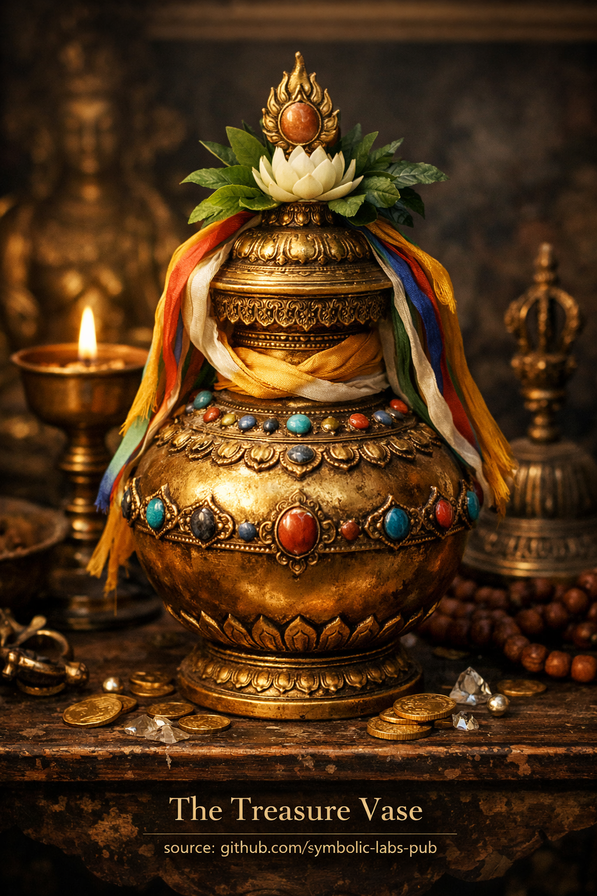

## [🏺 The Treasure Vase (Skt. *Nidhāna-kumbha*, Tib. *Bumpa*)](https://github.com/symbolic-labs-pub/a-buddhist-view/blob/master/more/09_symbols/21_treasure_vase/README.md#-the-treasure-vase-skt-nidhāna-kumbha-tib-bumpa)

---

The **Treasure Vase** is one of the **Eight Auspicious Symbols** in Buddhism. It represents **inexhaustible abundance**, but crucially, not in a crude material sense. Its teaching is subtle, psychological, and deeply ethical.

---

### 1. Core Meaning — *Abundance Without Depletion*

The Treasure Vase symbolizes **wealth that does not run out**:

* spiritual merit (*puṇya*)
* [wisdom (*prajñā*)](../../01_core_teachings/the_noble_eightfold_path/README.md#1-wisdom-paññā)
* health, longevity, and favorable conditions
* inner richness rather than accumulation

Unlike ordinary containers, the vase is said to be **always full**, no matter how much is taken from it. This points directly to a [Mahāyāna](../../05_yanas/README.md#limitation-from-mahāyāna-view) insight:

> True abundance is **non-rivalrous**—giving does not reduce it.

---

### 2. Philosophical Teaching — *Emptiness as the Source of Wealth*

At a deeper level, the Treasure Vase is a symbol of **Śūnyatā ([emptiness](../../10_concepts/01_emptiness/README.md#emptiness-śūnyatā-in-vajrayāna-buddhism))** expressed as **potential**.

* Because phenomena are empty of fixed essence, they are **functionally infinite**
* Scarcity arises from grasping, not from reality itself
* When clinging relaxes, resources circulate freely

In this sense, the Treasure Vase teaches that **emptiness is not lack, but generativity**.

---

### 3. Ethical Dimension — *Right Relationship to Resources*

The Treasure Vase directly counters two extremes:

* **Greed** (hoarding, fear of loss)
* **Ascetic rejection** (denial of worldly support)

Instead, it teaches:

* wealth as **support for [awakening](../../10_concepts/README.md#3-enlightenment-bodhi-awakening)**
* prosperity as something to be **circulated**, not possessed
* responsibility proportional to capacity

Abundance is not a personal trophy; it is a **shared condition**.

---

### 4. Vajrayāna Perspective — *Ritual and Energetic Function*

In [Vajrayāna](../../05_yanas/README.md#4-vajrayāna-tantrayāna-mantrayāna---the-diamond-vehicle) Buddhism, the Treasure Vase is also literal:

* vases are consecrated and filled with substances, [mantras](../10_mantra/README.md#what-a-mantra-is-buddhist-view), and relics
* buried or placed to **stabilize land, communities, and practice centers**
* used to harmonize elemental forces (*earth, water, fire, air, space*)

Here, abundance is understood as **energetic coherence**, not money.

---

### 5. Psychological Insight — *Security Without Clinging*

On the level of mind-training:

* the vase represents **deep trust**
* fear-based accumulation dissolves
* generosity becomes effortless

A practitioner embodying the Treasure Vase:

* feels internally resourced
* does not panic about the future
* gives naturally, without self-sacrifice drama

---

### 6. Condensed Teaching

> **The Treasure Vase teaches that when grasping ends, sufficiency appears.
> Wealth flows best through open hands and an open mind.**

It is not a promise of riches—it is a correction of **how the mind relates to having**.

---

< [The Parasol (Chatra) — according to Buddhist teachings](../20_parasol/README.md) | [Victory Banner (Skt. *Dhvaja*) — Buddhist Meaning](../22_victory_banner/README.md) >

_source: [github.com/sybolic-labs-pub](https://github.com/sybolic-labs-pub)_

---
