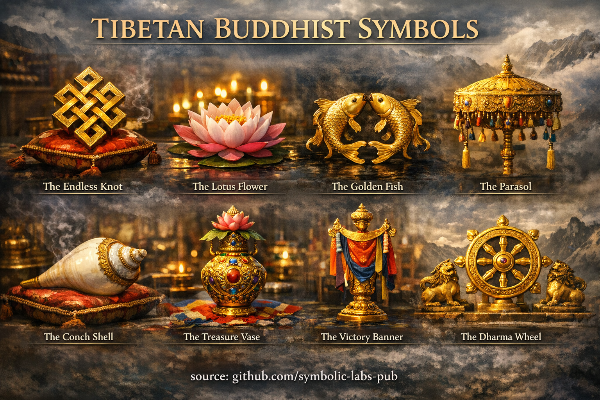
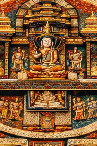
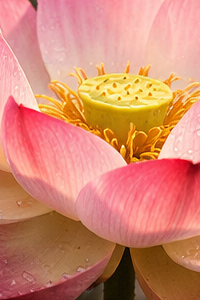
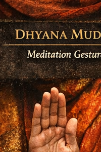
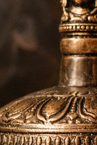
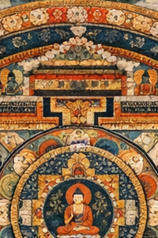
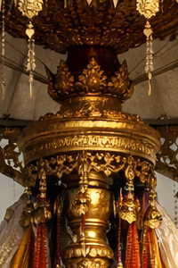
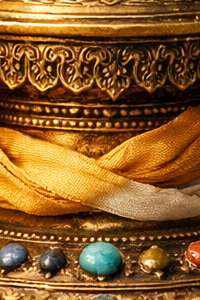
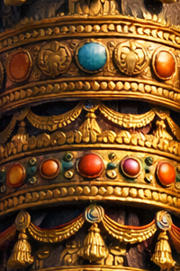

# [Symbols](https://github.com/symbolic-labs-pub/a-buddhist-view/blob/master/more/09_symbols/README.md#symbols)

## [1. Blessing Cord (Protection Cord)](01_blessing_cord/README.md)

**What it is**
A consecrated cord, often tied around the neck or wrist.

**Meaning**

* Continuous **lineage blessing**
* Reminder of **vows, refuge, or empowerment**
* Protective *field*, not superstition

**How it’s used**

* Worn quietly, not displayed
* Not removed casually
* Works through **remembrance and intention**, not magic

---

## [2. Dorje (Vajra)](02_dorje/README.md)

**Meaning**

* **Indestructible clarity**
* Union of **method ([compassion](../02_from_ignorance_to_awakening/7_compassion/README.md#compassion-as-a-structural-principle-in-buddhist-teaching))** and **[wisdom](../01_core_teachings/the_noble_eightfold_path/README.md#1-wisdom-paññā) (emptiness)](../10_concepts/01_emptiness/README.md#emptiness-śūnyatā-in-mahāyāna-buddhism))**
* Reality that cannot be destroyed by confusion

**Practice function**

* Held in the right hand during rituals
* Used with the bell (wisdom)
* Represents **unshakeable awakened [awareness](../10_concepts/README.md#2-awareness-rigpa-vijñāna-knowing)**

---

## [3. Prayer Wheel (Mani Wheel)](03_prayer_wheel/README.md)

**Meaning**

* Mantras in **physical rotation**
* Mind + body + mantra synchronized

**How it works**

* Turned **clockwise**
* Each rotation = recitation
* Emphasizes **continuity**, not speed

---

## [4. Prayer Flags (Lungta)](04_prayer_flags/README.md)

**Meaning**

* Wind carries prayers into space
* Teachings dissolve into the world

**Colors & elements**

* Blue (space)
* White (air)
* Red (fire)
* Green (water)
* Yellow (earth)

**Important insight**
As flags fade, the **ego dissolves**—the blessing remains.

---

## [5. Stupa](05_stupa/README.md)

**What a [stupa](05_stupa/README.md#1-what-a-stupa-is-beyond-architecture) is**

* **Embodied [enlightenment](../10_concepts/README.md#3-enlightenment-bodhi-awakening)**
* Represents Buddha’s mind, speech, and body

**Why clockwise (pradakshina)**

* Aligns with **cosmic order**
* Mirrors natural cycles (sun, stars)
* Keeps the **heart toward awakening**

Circumambulation is **walking [meditation](../08_lineage/README.md)**, not tourism.

---

## [6. Mala](06_mala/README.md)

 (Prayer Beads)

**Structure**

* 108 beads (or divisions thereof)
* Guru bead = **non-counted anchor**

**How to use**

* Move beads **toward yourself**
* Don’t cross the guru bead
* Used for mantra, breath, or intention

**Meaning**
Each bead = **one moment of awareness reclaimed**

---

## [7. Mandala](07_mandala/README.md)

**Meaning**

* Sacred **map of awakened mind**
* Geometry of realization

**Practice function**

* Visualization training
* Dissolution teaches [**impermanence**](../01_core_teachings/impermanence/README.md#2-impermanence-anicca-is-structural-not-accidental)
* Builds inner structure

[Mandala](07_mandala/README.md#mandala--explained-according-to-buddhist-teachings) is not decoration—it is **cognitive architecture**.

---

## [8. Lotus](08_lotus/README.md)

**Meaning**

* Purity **without rejection**
* Awakening *through* conditions, not away from them

**Core teaching**
Mud nourishes the lotus.
[Suffering](../02_from_ignorance_to_awakening/2_the_four_noble_truths/README.md#1-there-is-suffering--dukkha) nourishes awakening.

---

## 9. Lotus Posture (Padmāsana)

**Meaning**

* Physical **stability mirrors mental stability**
* Body becomes a mandala

**Important note**
Lotus posture is **symbolic**, not mandatory.
Awareness > flexibility.

---

## [10. Mantra](10_mantra/README.md)

**Meaning**

* “Mind protection”
* Sound as **patterned awareness**

**Function**

* Interrupts discursive mind
* Encodes lineage insight
* Aligns speech with realization

[Mantra](10_mantra/README.md#what-a-mantra-is-buddhist-view) is **frequency discipline**, not affirmation.

---

## [11. Mudra](11_mudra/README.md)

**Meaning**

* Hand gestures as **cognitive switches**
* Body language of enlightenment

**Examples**

* Teaching [mudra](11_mudra/README.md#abhaya-mudrā-fearlessness)
* Meditation mudra
* Fearlessness mudra

Mudra trains **embodied wisdom**, not symbolism alone.

---

## [12. Bell](12_bell/README.md)

 (Ghanta)

* Wisdom
* [Emptiness](../10_concepts/01_emptiness/README.md#emptiness-śūnyatā-in-vajrayāna-buddhism)
* Left hand (receptivity)

---

## [13. Skull Cup](13_skull_cup/README.md)

 (Kapala)

* Transformation of ego
* Death as teacher
* Used in advanced [Vajrayāna](../05_yanas/README.md#4-vajrayāna-tantrayāna-mantrayāna---the-diamond-vehicle)

---

## [14. Mala Counters](14_mala_counters/README.md)

* Track vows and commitments
* Emphasize **discipline over inspiration**

---

## [15. Thangka](15_thangka/README.md)

* Portable mandala
* Visual transmission
* Used for visualization training

---

## [16. Endless Knot](16_endless_knot/README.md)

* Interdependence
* Non-linear causality
* Karma as structure, not fate

---

## [17. Dharma Wheel](17_dharma_wheel/README.md)

* Teaching in motion
* Ethical orientation
* Eightfold structure

---

## [18. Conch Shell](18_conch_shell/README.md)

* Proclamation of Dharma
* Wake-up call for awareness

---

## Structural Insight (Very Important)

Tibetan Buddhist symbols are **not metaphors**.
They are:

* **Cognitive tools**
* **Embodied instructions**
* **Memory anchors**
* **Training devices**

They work **only when integrated** with:

* [Ethics (śīla)](../01_core_teachings/the_noble_eightfold_path/README.md#2-ethical-conduct-śīla)
* Meditation ([samādhi)](../03_the_path_to_end_suffering/README.md#right-action)
* Insight (prajñā)

---

## [The Golden Fish](19_golden_fish/README.md)

**Core meaning**
Freedom from fear and suffering.

**Teaching**
The two golden fish symbolize beings who have crossed the ocean of saṃsāra and now move freely, without drowning in suffering. Fish swim effortlessly in water—just as awakened beings move within experience without being trapped by it.

**Deeper insight**

* Freedom is **not escape**, but mastery of conditions
* Represents joy, spontaneity, and fearlessness
* Indicates liberation **within** the world, not outside it

Golden Fish remind practitioners that awakening is *fluidity of mind*, not withdrawal.

---

## [️ The Parasol](20_parasol/README.md)

**Core meaning**
Protection from suffering and harmful mental states.

**Teaching**
Traditionally associated with royalty, the parasol represents the dignity and protection of awakening. It shelters the mind from the heat of ignorance, attachment, anger, and pride.

**Deeper insight**

* Symbolizes ethical discipline and [mindfulness](../01_core_teachings/the_noble_eightfold_path/README.md#7-right-mindfulness-sammā-sati)
* Protection is **internal**, not external
* Represents compassionate leadership of one’s own mind

The Parasol teaches that **wisdom provides shade**, not isolation.

---

## [The Treasure Vase](21_treasure_vase/README.md)

**Core meaning**
Inexhaustible abundance and spiritual wealth.

**Teaching**
The treasure vase is always full and never depleted. It represents the boundless richness of the Dharma—merit, wisdom, compassion, and skillful means that increase through use rather than consumption.

**Deeper insight**

* True abundance is **non-zero-sum**
* Generosity expands inner capacity
* Emptiness allows fullness without grasping

The Treasure Vase teaches **abundance without attachment**.

---

## [The Victory Banner](22_victory_banner/README.md)

**Core meaning**
Triumph of wisdom over ignorance.

**Teaching**
The victory banner celebrates the Buddha’s complete victory over Māra—symbolizing the conquest of inner obstacles: ego-clinging, doubt, fear, and delusion.

**Deeper insight**

* Victory is **internal**, not competitive
* Represents perseverance and discipline
* Awakening is irreversible once stabilized

The Victory Banner proclaims that **clarity can prevail**, even against deeply ingrained habits.

---

### Synthesis

These four symbols together form a **structural map of liberation**:

* **Golden Fish** → Freedom
* **Parasol** → Protection
* **Treasure Vase** → Abundance
* **Victory Banner** → Completion

They are not decorative motifs—they are **cognitive and ethical instructions**, encoded in symbolic form for continual contemplation.

---

< [Victory Banner (Skt. *Dhvaja*) — Buddhist Meaning](22_victory_banner/README.md) | [Emptiness (Śūnyatā) in Vajrayāna Buddhism](../10_concepts/01_emptiness/README.md) >

_source: [github.com/symbolic-labs-pub](https://github.com/symbolic-labs-pub)_

---
