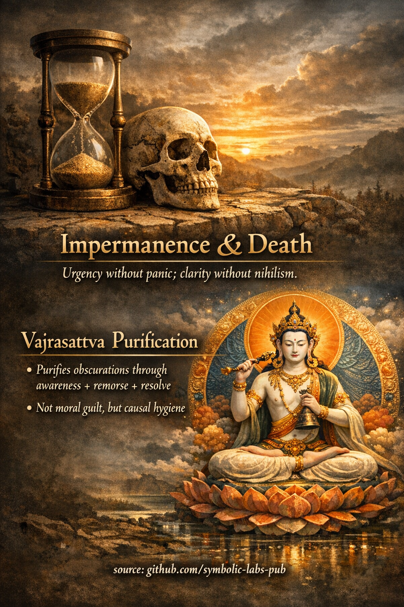

The **second Ngöndro practice** is **Vajrasattva purification**.
It is not moral self-judgment and not psychological catharsis—it is a **technical method for restoring the clarity of awareness** by releasing karmic obscurations that block recognition of mind’s nature.

---

## [2. Vajrasattva — Purification of Obscurations](https://github.com/symbolic-labs-pub/a-buddhist-view/blob/master/more/11_ngondro/2_purification/README.md#2-vajrasattva--purification-of-obscurations)

### Core function

**Purification precedes realization.**
Even correct [meditation](../../08_lineage/README.md) cannot stabilize if obscurations remain active. Vajrasattva practice clears the *conditions* that prevent insight from taking root.

This practice works on **three levels simultaneously**:

* **Behavioral** (unskillful actions)
* **Cognitive** (habitual fixation, distorted views)
* **Energetic** (latent karmic imprints)

---

## [Who Vajrasattva Represents](https://github.com/symbolic-labs-pub/a-buddhist-view/blob/master/more/11_ngondro/2_purification/README.md#who-vajrasattva-represents)

**Vajrasattva** is not an external god.
He is the **principle of indestructible purity**—the fact that awakened [awareness](../../10_concepts/README.md#2-awareness-rigpa-vijñāna-knowing) is *never actually stained*, only temporarily obscured.

* White color → **unconditional purity**
* Vajra + bell → **method and [wisdom](../../01_core_teachings/the_noble_eightfold_path/README.md#1-wisdom-paññā) unified**
* Seated in union posture → **inseparability of [emptiness](../../10_concepts/01_emptiness/README.md#emptiness-śūnyatā-in-vajrayāna-buddhism) and appearance**

You are not asking Vajrasattva to forgive you.
You are **recognizing purity as already present** and dissolving what blocks that recognition.

---

## [The Four Powers (Structural Core)](https://github.com/symbolic-labs-pub/a-buddhist-view/blob/master/more/11_ngondro/2_purification/README.md#the-four-powers-structural-core)

Vajrasattva purification is effective because it applies the **Four Opponent Powers**, a precise causal framework:

### 1. Power of Support

You take refuge in:

* Buddha ([awakening](../../10_concepts/README.md#3-enlightenment-bodhi-awakening))
* [Dharma (truth of cause and effect)](../../01_core_teachings/the_three_jewels/README.md#2-dharma--the-path-and-the-law-of-reality)
* Sangha (realized continuity)

This establishes **correct orientation**.

---

### 2. Power of Regret (Not Guilt)

Regret here means:

> *Clear recognition of cause → effect*

There is **no self-blame**.
Only lucid acknowledgment: *“This leads to [suffering](../../02_from_ignorance_to_awakening/2_the_four_noble_truths/README.md#1-there-is-suffering--dukkha).”*

This aligns perfectly with modern cognitive deconditioning:

* Awareness without identification
* Responsibility without shame

---

### 3. Power of Remedy

You recite the **100-syllable Vajrasattva [mantra](../../09_symbols/10_mantra/README.md#what-a-mantra-is-buddhist-view)** (or a short form).

The mantra is not symbolic—it is **patterned cognition**:

* Interrupts karmic replay loops
* Re-imprints clarity at the level of habit
* Synchronizes body, speech, and mind

Visualization (optional but powerful):

* Nectar flows from Vajrasattva
* Obscurations dissolve as dark smoke
* Mind becomes clear, light, unobstructed

---

### 4. Power of Resolve

You conclude with **structural intention**:

> *“I will not repeat this pattern as best I can.”*

Not perfection—**trajectory correction**.

This seals the purification so it does not rebound.

---

## [Why This Practice Comes Second](https://github.com/symbolic-labs-pub/a-buddhist-view/blob/master/more/11_ngondro/2_purification/README.md#why-this-practice-comes-second)

[Ngöndro](../README.md#what-is-ngöndro-in-mahāyāna-buddhism) is **ordered engineering**, not devotion folklore.

1. **Refuge + Bodhicitta** → establishes direction
2. **Vajrasattva** → removes interference
3. [Mandala](../../09_symbols/07_mandala/README.md#mandala--explained-according-to-buddhist-teachings) Offering → releases attachment
4. [Guru Yoga](../4_guru_yoga/README.md#samsāra’s-unsatisfactoriness-→-guru-yoga) → collapses subject–object duality

If you skip purification:

* Devotion becomes emotional
* Meditation becomes unstable
* Insight fails to integrate into conduct

---

## [Key Insight (Often Missed)](https://github.com/symbolic-labs-pub/a-buddhist-view/blob/master/more/11_ngondro/2_purification/README.md#key-insight-often-missed)

> **Purification does not make you pure.
> It reveals that purity was never absent.**

Karma is not erased by effort—it is **rendered non-binding** when awareness is unobstructed.

---

## [Signs the Practice Is Working](https://github.com/symbolic-labs-pub/a-buddhist-view/blob/master/more/11_ngondro/2_purification/README.md#signs-the-practice-is-working)

* Reduced compulsive reactivity
* Less psychological “stickiness”
* Faster recovery after mistakes
* Increased transparency of mind
* [Ethics](../../01_core_teachings/the_noble_eightfold_path/README.md#2-ethical-conduct-śīla) become *effortless*, not forced

---

## [One-Sentence Teaching](https://github.com/symbolic-labs-pub/a-buddhist-view/blob/master/more/11_ngondro/2_purification/README.md#one-sentence-teaching)

**Vajrasattva practice restores the mind to functional clarity so that realization can actually take hold.**

---

< [The First Ngöndro Practice](../1_prostrations/README.md) | [The Third Ngöndro Practice](../3_mandala_offering/README.md) >

_source: [github.com/sybolic-labs-pub](https://github.com/sybolic-labs-pub)_

---
