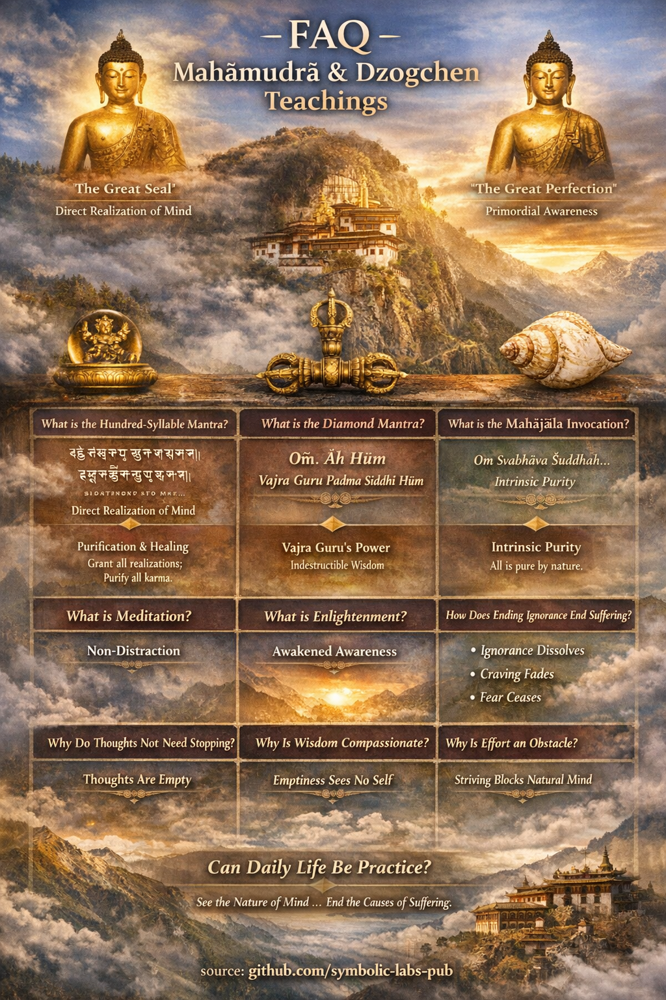

## [Frequently Asked Questions](https://github.com/symbolic-labs-pub/a-buddhist-view/blob/master/more/80_faq/README.md#frequently-asked-questions)

[](https://github.com/symbolic-labs-pub/a-buddhist-view/blob/master/more/80_faq/README.md#frequently-asked-questions)

<details>
<summary>1. What is Mahāmudrā?</summary>

**Mahāmudrā** means *"Great Seal."*
It refers to the **direct realization of the nature of mind**—[empty](../10_concepts/01_emptiness/README.md#emptiness-śūnyatā-in-vajrayāna-buddhism), luminous, and aware.

In Mahāmudrā:

* Mind is not *created* or *improved*
* Reality is **recognized**, not fabricated
* Thoughts are not obstacles but expressions of [awareness](../10_concepts/README.md#2-awareness-rigpa-vijñāna-knowing)

> Mahāmudrā teaches *seeing mind as it already is*.

</details>

---

<details>
<summary>2. What is Dzogchen?</summary>

**Dzogchen** means *"Great Perfection."*
It points directly to **rigpa**—primordial awareness that is:

* Empty (śūnya)
* Luminous (clarity)
* Self-knowing (reflexive awareness)

Dzogchen emphasizes:

* Immediate recognition over gradual cultivation
* Naturalness over correction
* Spontaneous presence over effort

> Dzogchen says: *Nothing is missing. Nothing needs fixing.*

</details>

---

<details>
<summary>3. Are Mahāmudrā and Dzogchen the same?</summary>

They are **functionally equivalent**, but stylistically different:

| Aspect     | Mahāmudrā                 | Dzogchen                      |
| ---------- | ------------------------- | ----------------------------- |
| Path style | Progressive → direct      | Direct from the start         |
| Language   | Analytical + experiential | Poetic + symbolic             |
| Entry      | Often via tantra          | Often via direct introduction |

Both lead to **the same realization**.

</details>

---

## Mantras & Invocations


---

<details>
<summary>4. What is the Hundred-Syllable Mantra?</summary>

#### Tibetan

```
ཨོཾ་བཛྲ་ས་ཏྭ་ས་མ་ཡ༔
མ་ནུ་པཱ་ལ་ཡ༔
བཛྲ་ས་ཏྭ་ཏྭེ་ནོ་པ་ཏིཥྛ༔
དྲྀ་ཌྷོ་མེ་བྷ་ཝ༔
སུ་ཏོ་ཥྱོ་མེ་བྷ་ཝ༔
སུ་པོ་ཥྱོ་མེ་བྷ་ཝ༔
ཨ་ནུ་རཀྟོ་མེ་བྷ་ཝ༔
སརྦ་སིདྡྷི་མེ་པྲ་ཡ་ཙྪ༔
སརྦ་ཀརྨ་སུ་ཙ་མེ༔
ཙིཏྟཾ་ཤྲེ་ཡཿཀུ་རུ་ཧཱུྂ༔
ཧ་ཧ་ཧ་ཧ་ཧོ༔
བྷ་ག་ཝཱན༔
སརྦ་ཏ་ཐཱ་ག་ཏ༔
བཛྲ་མ་མེ་མུཉྩ༔
བཛྲཱི་བྷ་ཝ༔
མ་ཧཱ་ས་མ་ཡ་ས་ཏྭ་ཨཱཿ
```

#### Sanskrit (IAST)

```
Oṁ Vajrasattva samayam anupālaya
Vajrasattva tveno-patiṣṭha
Dṛḍho me bhava
Sutoṣyo me bhava
Supoṣyo me bhava
Anurakto me bhava
Sarva siddhiṁ me prayaccha
Sarva karma su ca me
Cittaṁ śreyaḥ kuru hūṁ
Ha ha ha ha hoḥ
Bhagavan
Sarva Tathāgata
Vajra mā me muñca
Vajrī bhava
Mahā samaya sattva āḥ
```

#### English (Meaning)

> "O [Vajrasattva](../08_lineage/13_vajrasattva/README.md#vajrasattva-dorje-sempa), uphold your sacred commitment.
> Abide within me.
> Make me stable, joyful, nourished, and protected.
> Grant all realizations and purify all actions.
> Transform my mind toward virtue.
> O Blessed One, embodiment of all Buddhas,
> Do not abandon me—
> Make me inseparable from awakened purity."

**Purpose:**
Purification of karmic obscurations and broken samaya.

</details>

---

<details>
<summary>5. What is the Diamond Mantra?</summary>

Usually refers to the **[Vajra](../09_symbols/02_dorje/README.md#dorje-vajra--explained-according-to-buddhist-teachings) Guru Mantra**.

#### Tibetan

```
ཨོཾ་ཨཱཿཧཱུྂ་བཛྲ་གུ་རུ་པདྨ་སིདྡྷི་ཧཱུྂ༔
```

#### Sanskrit

```
Oṁ āḥ hūṁ vajra guru padma siddhi hūṁ
```

#### English (Meaning)

> "Oṁ — body, speech, and mind of the Vajra Guru,
> [Lotus](../09_symbols/08_lotus/README.md#the-lotus-in-buddhist-teaching)-born master, grant realization. Hūṁ."

**Meaning:**
Invocation of **indestructible awakened [wisdom](../01_core_teachings/the_noble_eightfold_path/README.md#1-wisdom-paññā)**.

</details>

---

<details>
<summary>6. What is the Mahājāla Invocation?</summary>

Mahājāla means **"Great Net"**—the interwoven field of awakened mind.

#### Tibetan (common form)

```
ཨོཾ་སྭ་བྷཱ་ཝ་ཤུདྡྷ་སརྦ་དྷརྨ་སྭ་བྷཱ་ཝ་ཤུདྡྷོ་ཧཾ༔
```

#### Sanskrit

```
Oṁ svabhāva śuddhaḥ sarva dharmāḥ svabhāva śuddho 'ham
```

#### English (Meaning)

> "All phenomena are pure by nature.
> I, too, am that intrinsic purity."

**Function:**
Dissolves dualistic perception before practice.

</details>

---

## Core Philosophical Questions


---

<details>
<summary>7. What is meditation?</summary>

Meditation is **not thinking less**.

Meditation is:

* Recognizing awareness
* Remaining without manipulation
* Allowing thoughts to self-liberate

> Meditation is *non-distraction*, not [concentration](../01_core_teachings/the_noble_eightfold_path/README.md#8-right-concentration-sammā-samādhi).

</details>

---

<details>
<summary>8. What is enlightenment?</summary>

Enlightenment is:

* The **complete exhaustion of ignorance**
* Continuous recognition of awareness
* [Compassion](../02_from_ignorance_to_awakening/7_compassion/README.md#compassion-as-a-structural-principle-in-buddhist-teaching) arising spontaneously

It is **not**:

* Bliss forever
* A special state
* A personality upgrade

> Enlightenment is *seeing clearly, all the time*.

</details>

---

<details>
<summary>9. How does removing ignorance eliminate suffering?</summary>

Ignorance (*avidyā*) is:

* Mistaking thoughts for self
* Mistaking [impermanence](../01_core_teachings/impermanence/README.md#2-impermanence-anicca-is-structural-not-accidental) for stability
* Mistaking appearance for substance

When ignorance dissolves:

* Craving has no fuel
* Aversion loses reference
* Fear collapses

> Suffering ends not by changing the world,
> but by **seeing the world correctly**.

</details>

---

<details>
<summary>10. Why do thoughts not need to be stopped?</summary>

Because:

* Thoughts are empty
* Suppressing them creates conflict
* Recognition liberates them instantly

</details>

---

<details>
<summary>11. Why is compassion inseparable from wisdom?</summary>

Because:

* Seeing emptiness removes self-centeredness
* Without self, others naturally matter
* Compassion is not moral—it is structural

</details>

---

<details>
<summary>12. Why is effort an obstacle at advanced stages?</summary>

Because:

* Effort implies a goal
* Awareness is already complete
* Trying subtly reinforces duality

</details>

---

<details>
<summary>13. Why are lineage and transmission emphasized?</summary>

Because:

* Recognition is contagious
* Words alone are insufficient
* Direct pointing bypasses conceptual traps

</details>

---

<details>
<summary>14. Can ordinary life be practice?</summary>

Yes.
In Mahāmudrā and Dzogchen:

* Eating is meditation
* Thinking is meditation
* Dying is meditation

> The only failure is forgetting awareness.

</details>

---

## Summary


Mahāmudrā and Dzogchen do **not add anything**.
They **remove confusion**.

When ignorance ends:

* Suffering collapses
* Compassion flows
* Freedom becomes ordinary


---

< [The Preliminary Practices (Ngöndro)](../11_ngondro/README.md) | [A Buddhist View](../../README.md) >

_source: [github.com/symbolic-labs-pub](https://github.com/symbolic-labs-pub)_

---
